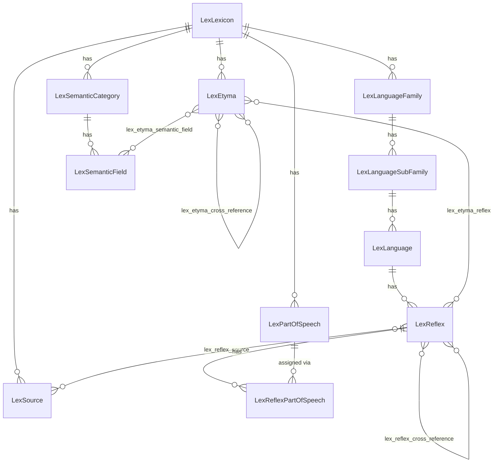
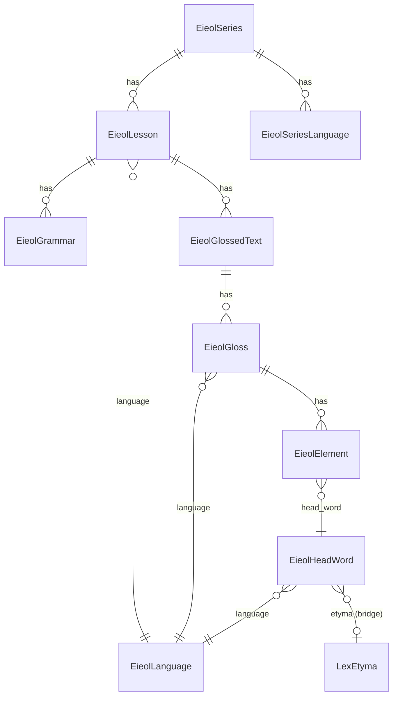

# LRC Domain Model

Last verified: 2026-09-16 against commit c0fde76.

This document catalogs every Eloquent model in `server/app/Models`, grouped into the five clusters the platform's data actually falls into, with the table each model maps to, what it represents, its key relationships, and which of its attributes are translatable via `spatie/laravel-translatable`. All paths are relative to `server/` unless otherwise noted.

## Lexicon cluster

The comparative-etymology framework behind IELEX, SEMITILEX, MAYALEX, and DRAVIDILEX. Everything scopes down from `LexLexicon` via `lexicon_id` (directly, or transitively through `LexLanguageFamily` / `LexSemanticCategory`).

| Model | Table | Represents | Key relationships | Translatable |
|---|---|---|---|---|
| `LexLexicon` | `lex_lexicon` | One named lexicon/dictionary (IELEX, SEMITILEX, MAYALEX, DRAVIDILEX…) | `hasMany` `etyma`, `semantic_categories`, `language_families` | `protolang_name`, `protolanguage_page_content`, `landing_page_content` |
| `LexLanguageFamily` | `lex_language_family` | Top-level language family within a lexicon | `belongsTo` `lexicon`; `hasMany` `language_sub_families` | `name` |
| `LexLanguageSubFamily` | `lex_language_sub_family` | Sub-family under a family | `belongsTo` `language_family`; `hasMany` `languages` | `name` |
| `LexLanguage` | `lex_language` | A daughter/attested language | `belongsTo` `language_sub_family`; `hasMany` `reflexes` (ordered by the JSON `entries` column — see Invariants) | `name`, `description` |
| `LexEtyma` | `lex_etyma` | A reconstructed proto-language root | `belongsTo` `lexicon`; `belongsToMany` `semantic_fields`, `reflexes` (via `lex_etyma_reflex`), `cross_references` (self, via `lex_etyma_cross_reference`); `hasMany` `extra_data` | `gloss` |
| `LexReflex` | `lex_reflex` | An attested word in a daughter language descending from an etymon | `belongsTo` `language`; `belongsToMany` `etyma` (via `lex_etyma_reflex`), `sources` (via `lex_reflex_source`, with pivot `page_number`/`original_text`), `cross_references_to`/`cross_references_from` (self, via `lex_reflex_cross_reference`); `hasMany` `parts_of_speech`, `extra_data` | `gloss` |
| `LexSemanticCategory` | `lex_semantic_category` | Buck-style top-level semantic taxonomy grouping | `belongsTo` `lexicon`; `hasMany` `semantic_fields` | `text` |
| `LexSemanticField` | `lex_semantic_field` | A specific semantic field/gloss category under a category | `belongsTo` `semantic_category`; `hasOneThrough` `lexicon` (via `semantic_category`); `belongsToMany` `etyma` | `text` |
| `LexSource` | `lex_source` | A bibliographic source cited by reflexes | `belongsTo` `lexicon`; `hasMany` `reflex` (dead — see Invariants) | — |
| `LexPartOfSpeech` | `lex_part_of_speech` | A part-of-speech code/label, per lexicon | `belongsTo` `lexicon`; `hasMany` `reflex` (dead — see Invariants) | `display` |
| `LexEtymaReflex` | `lex_etyma_reflex` | Pivot: etymon ↔ reflex | `hasOne` `etyma`, `hasOne` `reflex` (should be `belongsTo` — see Invariants) | — |
| `LexEtymaSemanticField` | `lex_etyma_semantic_field` | Pivot: etymon ↔ semantic field | `hasOne` `etyma`, `hasOne` `semantic_field` (should be `belongsTo`) | — |
| `LexReflexSource` | `lex_reflex_source` | Pivot: reflex ↔ source, with citation metadata | `hasOne` `reflex`, `hasOne` `source` (should be `belongsTo`) | — |
| `LexReflexPartOfSpeech` | `lex_reflex_part_of_speech` | Ordered part-of-speech assignment for a reflex | `belongsTo` `reflex` (correct); `hasOne` `part_of_speech`; `hasOneThrough` `language` | — |
| `LexEtymaExtraData` | (guarded model, no explicit `$table`; defaults to `lex_etyma_extra_data`) | Free-form key/value extra fields on an etymon | none declared | `value` |
| `LexReflexExtraData` | (no explicit `$table`; defaults to `lex_reflex_extra_data`) | Free-form key/value extra fields on a reflex | none declared | `value` |
| `LexEtymaCrossReference` | `lex_etyma_cross_reference` | Pivot: etymon ↔ etymon cross-reference | none declared — bare pivot model | — |
| `LexReflexCrossReference` | `lex_reflex_cross_reference` | Pivot: reflex ↔ reflex cross-reference, typed by `relationship` | Extends `Pivot`; `belongsTo` `to_reflex`, `from_reflex` | `relationship` |

## EIEOL cluster

The lesson-series model backing the "Early Indo-European Online" language-learning content.

| Model | Table | Represents | Key relationships | Translatable |
|---|---|---|---|---|
| `EieolSeries` | `eieol_series` | One lesson series (e.g. a language course) | `hasMany` `lessons`, `languages`; `belongsToMany` `lesson_languages` (distinct languages across the series' lessons, via `eieol_lesson`) | — |
| `EieolLesson` | `eieol_lesson` | One lesson within a series | `belongsTo` `series`, `language`; `hasMany` `grammars`, `glossed_texts` | — |
| `EieolGrammar` | `eieol_grammar` | A grammar-note section within a lesson | `belongsTo` `lesson` | — |
| `EieolGlossedText` | `eieol_glossed_text` | An interlinear-glossed text passage within a lesson | `belongsTo` `lesson`; `hasMany` `glosses` | — |
| `EieolGloss` | `eieol_gloss` | One glossed word/phrase within a glossed text | `belongsTo` `glossed_text`, `language`; `hasMany` `elements` | — |
| `EieolElement` | `eieol_element` | A morphological element (analysis) within a gloss, pointing at a head word | `belongsTo` `gloss`, `head_word` | — |
| `EieolHeadWord` | `eieol_head_word` | A dictionary head word used across glosses | `hasMany` `elements`; `belongsTo` `language`, and `belongsTo` `LexEtyma` (the bridge into the Lexicon cluster) | — |
| `EieolLanguage` | `eieol_language` | A language used within EIEOL (distinct from `LexLanguage`) | referenced by `EieolLesson`, `EieolGloss`, `EieolHeadWord` | — |
| `EieolSeriesLanguage` | `eieol_series_language` | Languages associated with a series, for display | `belongsTo` `series`; no timestamps | — |
| `IsoLanguage` | `iso_language` | ISO 639 language code lookup used only by the legacy series editor | none declared | — |

**The bridge:** `EieolHeadWord::etyma()` is a `belongsTo(LexEtyma::class)`, linking an EIEOL dictionary head word to its reconstructed proto-root in the Lexicon cluster. It is the only relationship connecting the two clusters. Note also the cascade-delete hazard flagged in the private security review: deleting a `LexEtyma` cascades to delete dependent `EieolHeadWord` rows (migration `2024_07_19_143025_add_cascade_deletes.php`).

## CMS cluster

| Model | Table | Represents | Key relationships | Translatable |
|---|---|---|---|---|
| `Page` | `page` | A static CMS page (guides, home content) | none declared | `name`, `content` |
| `Book` | `book` | A printable/multi-section document | `hasMany` `sections` (ordered) | — |
| `BookSection` | `book_section` | One section of a `Book` | `belongsTo` `book` | — |

## Users / permissions cluster

| Model | Table | Represents | Key relationships | Translatable |
|---|---|---|---|---|
| `User` | `user` | An authenticated account (staff/editors; no public registration) | `HasRoles` (Spatie); `belongsToMany` `editableSeries` (via `user_permission`) | — |
| `UserPermission` | `user_permission` | Legacy per-series edit-permission grant, predating Spatie roles | `belongsTo` `user`, `eieol_series` | — |

`User` implements Filament's `FilamentUser` contract; see `docs/architecture/auth.md` for the panel- and policy-level access-control model and the full permission-name inventory.

## Support cluster

| Model | Table | Represents | Key relationships | Translatable |
|---|---|---|---|---|
| `Issue` | `issue` | A flagged content issue, addressable by a `pointer` string into EIEOL content (e.g. `/lesson/12/grammar/3`) | `hasMany` `comments` | — |
| `IssueComment` | `issue_comment` | A comment thread entry on an `Issue` | `belongsTo` `issue` | — |

## Invariants and conventions

- **Lexicon scoping via `lexicon_id`.** Every Lexicon-cluster model that needs to know which dictionary it belongs to carries a `lexicon_id` foreign key, either directly (`LexEtyma`, `LexLanguageFamily`, `LexSemanticCategory`, `LexSource`, `LexPartOfSpeech`) or reached transitively (`LexLanguage` through `LexLanguageSubFamily`→`LexLanguageFamily`; `LexSemanticField` through `LexSemanticCategory`, via `hasOneThrough`). There is no lexicon-level global scope — controllers and Filament resources are individually responsible for filtering by the current lexicon's slug/id.
- **Blacklist mass assignment.** Nearly every model uses `protected $guarded = ['id']` (some add `created_at`/`updated_at`) rather than an explicit `$fillable` allowlist, which is a weaker default than an explicit allowlist. Confirmed instances where this becomes exploitable are covered in the private security review.
- **Translatable JSON columns.** `HasTranslations` (spatie/laravel-translatable) stores each translatable attribute as a JSON object keyed by locale in a single column — it is not a separate translations table. The three admin/content locales configured for Filament are `en`, `es`, `te` (`AdminPanelProvider`); these are independent of the "viewer language" concept used by the public lexicon pages (see `docs/architecture/i18n.md`).
- **`hasOne` vs `belongsTo` on pivots.** `LexEtymaReflex`, `LexEtymaSemanticField`, and `LexReflexSource` are modeled as ordinary `Model` subclasses (not Laravel `Pivot`), each with its own `id`, and each declares its parent-pointing relations as `hasOne(Related::class, 'id', 'foreign_id')` instead of the idiomatic `belongsTo(Related::class, 'foreign_id')`. The `hasOne` form happens to resolve correctly for reads (it matches `Related.id = $this->foreign_id`) but is non-idiomatic and risks `save()`/`associate()` semantics working backwards. `LexReflexPartOfSpeech::reflex()` and `LexReflexCrossReference` (a true `Pivot` subclass) get this right with `belongsTo`.
- **Deprecated `etymas()` relations.** `LexReflex::etymas()` and `LexSemanticField::etymas()` are both explicitly marked `@deprecated use etyma() instead` in a doc comment but are still functionally identical duplicates of `etyma()`/`reflexes()` and are still called from at least six places in views/controllers per the platform review (§3).
- **Dead relations.** `LexSource::reflex()` (keys on a `source_id` column that does not exist on `lex_reflex`; the real link is the `lex_reflex_source` pivot) and `LexPartOfSpeech::reflex()` / `LexReflexPartOfSpeech` (keys on `part_of_speech_id`, likewise absent) will raise a SQL error if ever called — part of speech is actually matched by text/code, not by a foreign key.
- **Dead/deprecated models.** `UserPermission` is annotated in its own source as `FIXME old table for mapping series edit permissions - replace with Spatie/permissions eventually` and is not enforced as an authorization check anywhere (see `docs/architecture/auth.md`). `LexEtymaCrossReference` is a bare model with no declared relations. `IsoLanguage` is used only by the legacy `/admin2` series editor.
- **`$appends` that lazy-load relations.** `LexEtyma` (`lexiconNameEntry`, `lexiconNameEntryGloss`), `LexReflex` (`langAbbrGloss`, `langNameEntriesGloss`), and `LexSemanticField` (`lexiconNameText`, `lexiconNameAbbrText`) all append accessors that read `$this->lexicon`/`$this->language`, so every `toArray()`/JSON serialization of these models triggers an extra query per record unless the relation is already eager-loaded.
